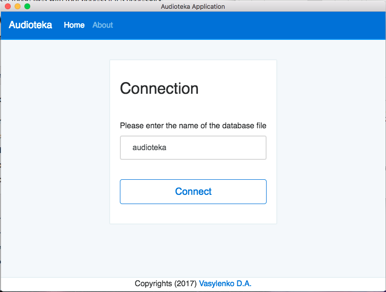
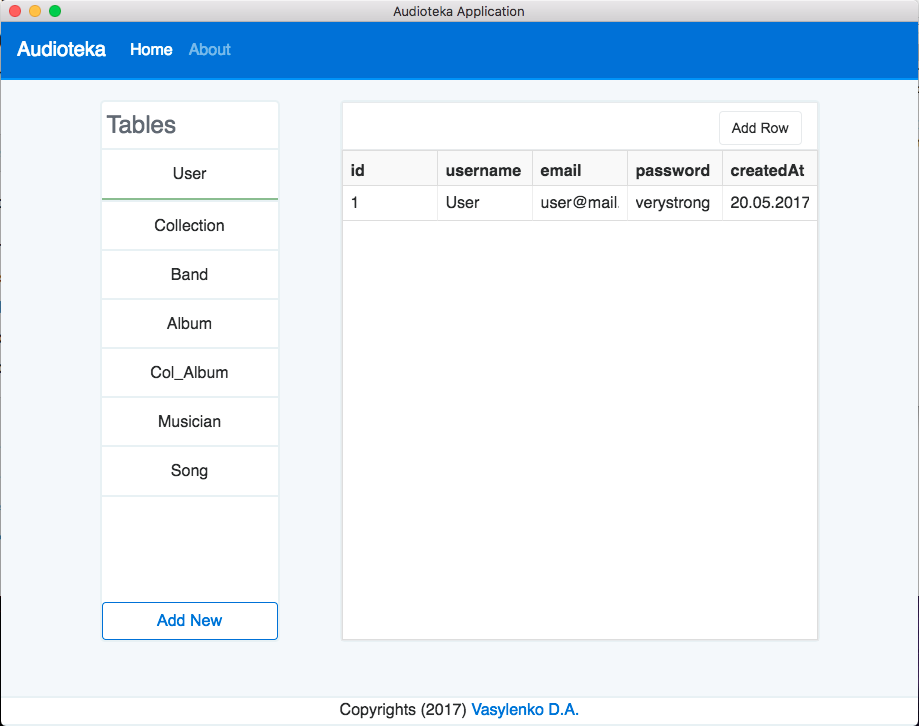
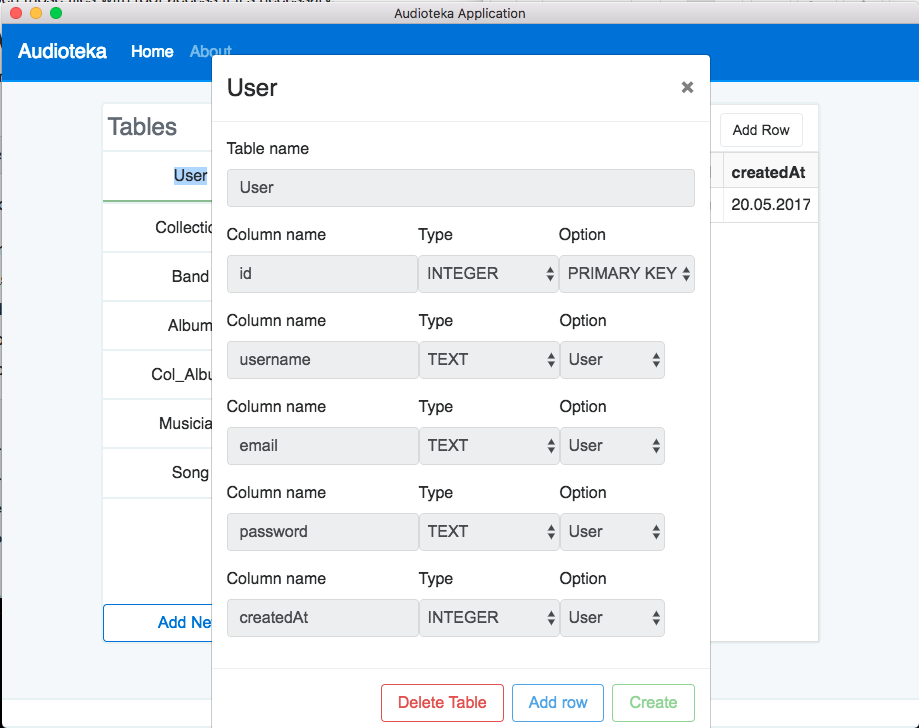
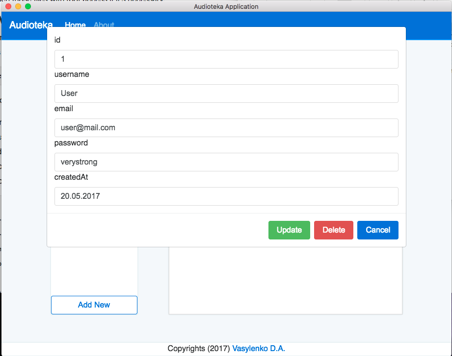
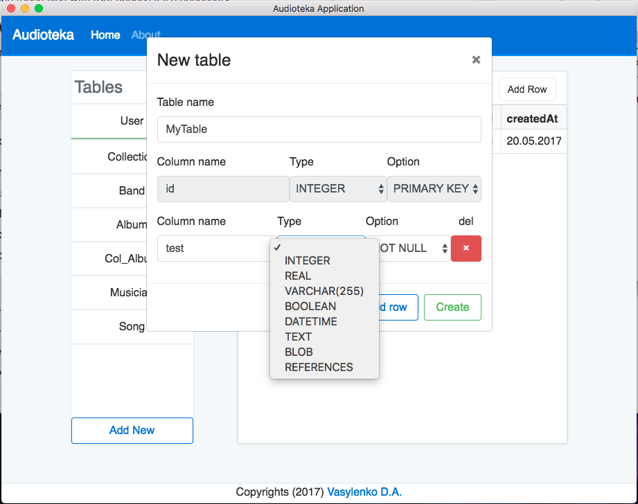

POC SQLite Management tool

Built w/ React

No Redux :(

Note, that this was done for a lab work @university and was not planned to be maintained further.

### Run
```
npm i
npm run dev
```

### Build
```
npm i
npm i -g webpack asar
webpack
npm run build
```

You can also pack it into ``*.asar``:
```
asar pack ./src app.asar
npm run dmg // => compiles into a MacOS app in the /builds folder
```










